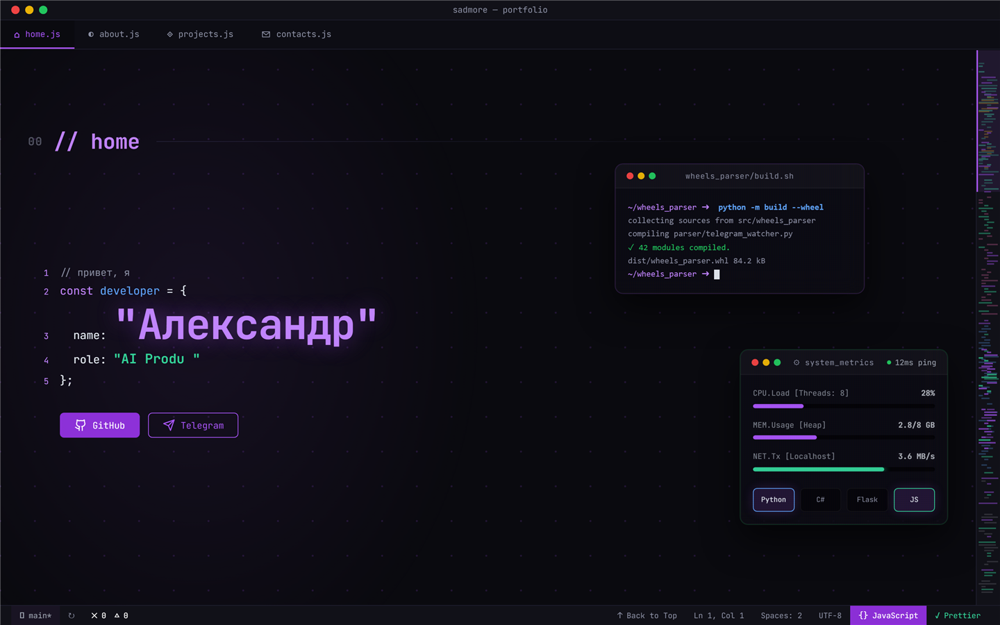
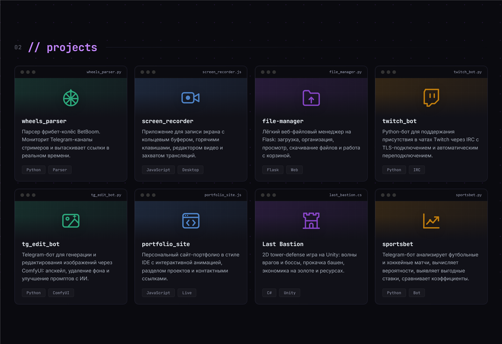
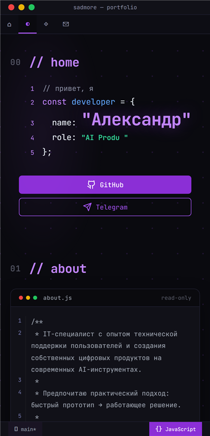

# portfolio_site

Персональный сайт-портфолио с интерфейсом в стиле IDE: вкладки-файлы, миникарта, статус-бар,
плавающие панели и анимации. Без фреймворков и сборщика — чистые HTML, CSS и JavaScript.

<!-- Замените ссылку на адрес GitHub Pages после включения деплоя -->
**[Открыть демо →](https://alekblackk.github.io/portfolio_site/)**



## Скриншоты

| Проекты | Мобильная версия |
| --- | --- |
|  |  |

## Возможности

- интерфейс в стиле редактора кода: вкладки разделов, миникарта, статус-бар;
- боковая панель Explorer + Activity Bar с навигацией по разделам;
- командная палитра (⌘K) с fuzzy-поиском команд и списком горячих клавиш;
- секции «Обо мне», «Проекты» и «Контакты» с карточками проектов;
- анимации появления карточек, 3D-наклон при наведении, плавающие панели;
- адаптивная вёрстка для компьютеров и мобильных устройств;
- тесты для навигации и плавающих панелей.

## Стек

- HTML5
- CSS3 (custom properties, grid, flexbox)
- JavaScript (ES2020, без зависимостей)
- Node.js — встроенный тестовый раннер

## Запуск

```bash
git clone https://github.com/AlekBlackk/portfolio_site.git
cd portfolio_site
npx serve .
```

Либо просто откройте `index.html` в браузере.

## Тесты

```bash
npm test
```

Зависимости не требуются: используется встроенный тестовый раннер Node.js.

## Структура проекта

```text
portfolio_site/
├── index.html      # разметка сайта
├── style.css       # стили и адаптивность
├── script.js       # интерактивность
├── favicon.svg     # иконка сайта
├── images/         # скриншоты
└── tests/          # автоматические тесты
```
